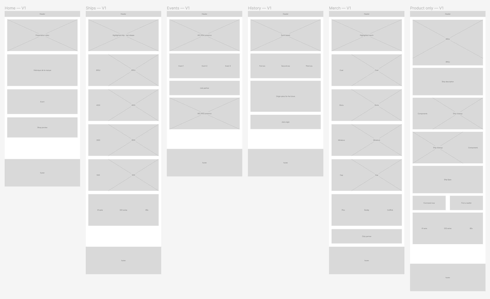

# Origin Jumpworks

**[origin-jumpworks.space](https://www.origin-jumpworks.space)**

Time spent for this project : 

_Pstt. Before reading this, if you wanted to fork this project there's the [setup.md](https://github.com/deavetheferret/origin-jumpworks/blob/main/setup.md) file._

## Table of content

- [Introduction](#introduction)
- [The project](#the-project)
- [Workflow](#workflow)
  - [Moodboard — Branding](#moodboard--branding)
  - [Moodboard — Website](#moodboard--website)
  - [Wireframe](#wireframe)
  - [Prototype](#prototype)
- [miscellaneous](#miscellaneous)
  - [Special thanks](#special-thanks)
  - [Social media](#social-media)
  - [Links](#links)
  - [Copyrights](#copyrights)

---

## Introduction

Origin Jumpworks is a dynamic and innovative project that leverages modern web technologies to deliver a seamless and engaging user experience. The project is built with Vue.js, a progressive JavaScript framework, and uses advanced features like GSAP (GreenSock Animation Platform) for smooth animations and CSS Scroll Snap for fluid navigation.

The project is structured into different sections, each representing a unique aspect of the application. Each section is designed to be fully responsive and to provide a consistent experience across different device sizes.

Origin Jumpworks is not just about the technology, but also about the user. The project aims to create an interface that is intuitive, user-friendly, and visually appealing. With a focus on performance and usability, Origin Jumpworks is designed to be fast, efficient, and easy to use.

Whether you're a developer looking to explore the code, or a user wanting to experience the application, we hope you find Origin Jumpworks to be a source of inspiration and a testament to what can be achieved with modern web technologies.

## The project

This project is called Origin Jumpworks, it was done as part of the S6 at Eikon. The S6 is 3 months of research, design, and production with the bonus of creating unique visuals.

This project is supposed to be the culmination of our accumulated knowledge from three years of work and study. We are also required to use and learn a new web development language, in my case it was Vue.js.

If you've spent some time browsing YouTube, you've probably noticed a game that's making more and more noise, Star Citizen.

An MMORPG set in space with no loading times and increasingly realistic mechanics, it's a true sandbox for any fan of space void and Star Wars.

This project invites you to visit the website of a company set in the lore of Star Citizen, Origin Jumpworks. A luxury spaceship brand that tells anyone who will listen that its ships are the best of all.

## Workflow

### Moodboard — Branding

### Wireframe

### Prototype

## Miscellaneous

### Special thanks

Thank to everybody who helped me once on this project, start with copilot who deserve better treatment than mine...

To my friends obviously, my family and this little thing every morning that helps me and a lot of person to work early, I'll name it coffee.

Just kidding but for real this project was made with ❤️ and ☕️.

### Social media

You can find me easily through the web like the rain drops who cannot escape from the stickyness of the spider web that has been fixed to this branch for to long...

Here are the links by the way :

- [Instagram](https://www.instagram.com/a.frankonmeta/)
- [Behance](https://www.behance.net/franksdev)
- [My website](https://www.a-frank.dev/)

### Links

- [Web project (origin-jumpworks.space)](https://www.origin-jumpworks.space)
- [Star citizen website](https://robertsspaceindustries.com/)
- [Vue.js](https://www.vuejs.org)

### Copyrights

> This website is only for personal purpose, it is not official or affiliated to Cloud Imperium. Made by a-frank.dev

> Origin Jumpworks™ and all its affiliated labels, logos or names are registered trademarks and the property of Cloud Imperium LLC and Cloud Imperium Ltd.

> © 2012-2024 Cloud Imperium Rights LLC and Cloud Imperium Rights Ltd.

> © 2024 a.frank dev
